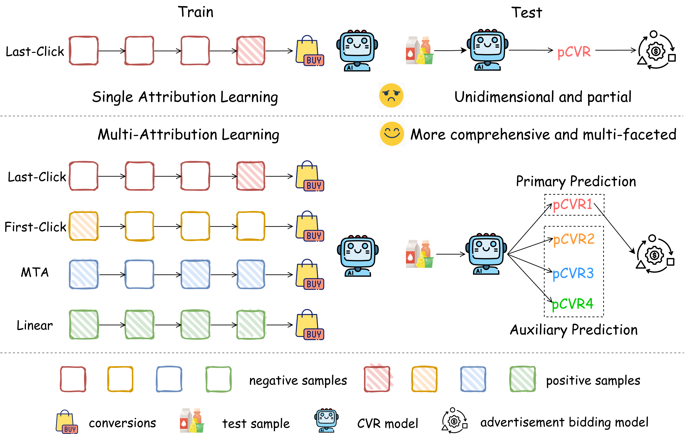

<h1 align='center'>PyMAL</h1>

<p align="center">
  <a href="#"></a>
  <a href="#">  </a>
  <a href="https://huggingface.co/datasets/alimamaTech/MAC">  </a>
</p>

<p align="center">
    <a href="#overview">Overview</a> |
    <a href="#set-up-environment">Set Up Environment</a> |
    <a href="#prepare-dataset">Prepare Dataset</a> |
    <a href="#run-experiments">Run Experiments</a> |
    <a href="#related-works">Related Works</a> |
    <a href="#citation">Citation</a>
</p>

This is the official pytorch implementation of paper "Benchmark, Insights and Approaches for Multi-Attribution Learning in Conversion Rate Prediction". Our framework targets industrial-scale CVR prediction scenarios that require learning from conversion labels generated by multiple attribution mechanisms to obtain a more comprehensive and robust understanding of touchpoint value.

## Overview

<div align="center">
  
</div>

## Set Up Environment

Our project relies on `python 3.10.18`. You need to install required dependencies from `requirements.txt`.

```bash
conda create -n mal python==3.10.18 -y
conda activate mal
pip install -r requirements.txt
```

## Prepare Dataset

To reproduce the results of the paper, the [MAC](https://huggingface.co/datasets/alimamaTech/MAC) dataset is required. MAC now is publicly available on [🤗 Hugging Face](https://huggingface.co/datasets/alimamaTech/MAC). You can download the dataset directly via `git clone`:
```bash
git clone https://huggingface.co/datasets/alimamaTech/MAC data
```

## Run Experiments
Before running the code, please make sure your working directory follows the structure below. Files and folders marked as **(from this GitHub project)** are provided in this repository. Items marked as **(from huggingface)** or **(after running preprocess.py)** must be prepared by you.
```text
.
├── data/                                             # Data directory
│   ├── cached/         (after runing preprocess.py)  # Preprocessed data
│   ├── test/           (from huggingface)            # Test data
│   ├── train/          (from huggingface)            # Training data
│   └── vocabs/         (from huggingface)            # ID mappings
│
├── model/              (from this github project)    # Model implementations
│   ├── net/                                          # network modules
│   ├── BASE.py                                       # Single-attribution baseline model
│   ├── ShareBottom.py                                # Shared-Bottom model
│   ├── MMoE.py                                       # MMoE model
│   ├── HoME.py                                       # HoME model
│   ├── PLE.py                                        # PLE model
│   ├── NATAL.py                                      # NATAL model implementation
│   └── MoAE.py                                       # Our proposed MoAE model implementation
│
├── results/            (after running code)          # Experiment outputs
│   ├── logs/                                         # Training and evaluation logs
│   └── runs/                                         # TensorBoard logs
│
├── scripts/            (from this github project)    # Shell scripts
│   └── run.sh                                        # Example script to launch traning
│
├── utils/              (from this github project)    # Utility modules
│   ├── data.py                                       # Data loading, batching, and dataset helpers
│   ├── grad.py                                       # Gradient utilities (e.g., GCS, PCGrad)
│   ├── trainer.py                                    # Training / evaluation loops and hooks
│   └── utils.py                                      # Misc common utilities (logging, config, seeds, etc.)
│
├── preprocess.py       (from this github project)    # Data preprocessing
└── run.py              (from this github project)    # Main entry point (configuration, training, evaluation)
```

Concretely, you need to:
1. Clone this repository, which provides `model/`, `scripts/`, `utils/`, `run.py`, `preprocess.py`, and `requirements.txt`.
2. Download the dataset from HuggingFace and place: training files into `data/train/`; test files into `data/test/`; vocab files into `data/vocabs/`.
3. Run `preprocess.py` once to generate cached preprocessed data in `data/cached/`.
4. Before running the experiments, if you need to modify the training configuration, you can set the command-line arguments in `utils/data.py` via `get_args()`.
5. Run experiments. After running, the code will automatically write: training and evaluation logs into `results/logs/`; TensorBoard logs into `results/runs/`.

**Then you can reproduce the experiments by using `scripts/run.sh`:**
```bash
sh scripts/run.sh
```
During training, you can monitor the loss and other metrics with TensorBoard:
```bash
tensorboard --logdir results/runs/
```

## Related Works
<a href="https://arxiv.org/abs/2508.15217" target="_blank">
See Beyond a Single View: Multi-Attribution Learning Leads to Better Conversion Rate Prediction
</a>

## Citation
If you find our work useful for your research, please consider citing the paper:
```
@article{wu2025mac,
  title={Benchmark, Insights and Approaches for Multi-Attribution Learning in Conversion Rate Prediction},
  author={Wu, Jinqi and Chen, Sishuo and Chan, Zhangming and Sheng, Xiang-Rong and Zhang, Lei and Chen, Sheng and Hou, Chenghuan and Zhu, Han and Xu, Jian and Zheng, Bo and Fu, Chaoyou},
  journal={arXiv preprint arXiv:XXXX.XXXX},
  year={2025}
}
```
